# GitHub Enterprise EMU 与 GHCP API Console 配置手册

本文面向第一次接触 GitHub Enterprise 管理、Enterprise Managed Users(EMU)、SAML SSO、SCIM、GitHub Copilot seat 和本项目部署配置的读者。目标是帮助你从零完成 GitHub Enterprise EMU 初始化、本项目 SSO/Console/Proxy/Login 服务配置、Copilot 授权管理，以及最终用户侧 API 调用验证。

> 重要：GitHub Copilot 当前不提供面向第三方服务端集成的正式公开裸 API。本项目依赖 GitHub Copilot 内部接口，适合学习、验证和自维护部署。用于生产前，需要自行评估合规、稳定性、安全、账号管理、日志留存和运维风险。

## 1. 你最终会配置出什么

完成本文步骤后，系统会形成如下链路：

```text
Client / SDK / Internal App
  -> proxy compatible API
  -> proxy 按 X-User-Identity 找到或初始化账号
  -> sso 创建本地 SSO 用户并通过 SCIM 同步到 GitHub Enterprise EMU
  -> login 通过 Playwright 完成 GitHub device flow + SSO 登录
  -> login 把 GitHub token 回写给 proxy
  -> proxy 换取 Copilot token 并转发请求到 GitHub Copilot 后端
```

后台管理入口是 `console`。管理员通过 `console` 管理 SSO 用户、EMU 同步、Copilot seat、AI Credits、Proxy 账号、Login 任务和请求统计。

| 模块 | 默认端口 | 作用 |
| --- | ---: | --- |
| `proxy` | `3000` | 对外提供 OpenAI / Anthropic / Responses 兼容 API；负责 API key、identity、GitHub token、Copilot token 和请求转发。 |
| `sso` | `7001` | 自定义 SAML IdP；管理本地 SSO 用户、SCIM/EMU、Copilot seat 和 AI Credits。 |
| `login` | `7003` | 通过 Playwright 自动完成 GitHub 登录，并把 GitHub token 回写给 `proxy`。 |
| `console` | `7004` | Web 管理控制台；统一操作 `proxy`、`sso`、`login` 的内部 API。 |

## 2. 关键概念

### 2.1 GitHub Enterprise EMU

GitHub Enterprise Managed Users(EMU) 是由企业统一管理的 GitHub 用户体系。EMU 用户不是普通个人 GitHub 账号，而是由企业身份系统通过 SAML SSO 登录、通过 SCIM 创建和管理。

创建 EMU 时会遇到两个重要字段：

| 字段 | 说明 |
| --- | --- |
| Enterprise slug | Enterprise 的 URL 标识。例如 slug 为 `acme` 时，Enterprise URL 中会出现 `/enterprises/acme`。 |
| shortcode | EMU 登录名后缀。例如 shortcode 为 `open`，本地 SSO 用户 `alice` 在 GitHub 侧登录名通常是 `alice_open`。 |

创建完成后，GitHub 会先生成一个初始超级管理员，格式通常是 `admin_<shortcode>`。后续建议通过本项目创建并同步一个新的管理员 EMU 用户，用它承担日常管理工作。

### 2.2 SAML SSO 与 SCIM

SAML SSO 解决“用户如何登录 GitHub Enterprise”的问题；SCIM 解决“用户如何被创建、更新、暂停、删除到 GitHub Enterprise”的问题。

在本文方案中：

- `sso` 服务扮演自定义 SAML IdP。
- GitHub Enterprise 作为 SAML SP。
- `sso` 服务使用 GitHub SCIM API 把本地用户同步为 EMU。
- SAML 配置中的 Sign on URL 指向 `https://<sso-public-base-url>/sso`。
- SAML 配置中的 Issuer 指向 `https://<sso-public-base-url>/metadata`。
- Public certificate 来自 `certs/idp-cert.pem`。

### 2.3 PAT、Copilot seat 与 AI Credits

本项目需要一个 GitHub 管理 PAT 写入 `GITHUB_COPILOT_SEAT_PAT`。它用于：

- 调用 `POST/DELETE /enterprises/{enterprise}/copilot/billing/selected_users` 分配或移除 Copilot seat。
- 调用 `/enterprises/{enterprise}/settings/billing/usage/summary?sku=copilot_ai_unit` 查询 AI Credits 用量。

创建 PAT 时，请使用已经同步到 GitHub Enterprise 且具备企业管理权限的 EMU 管理员账号。GitHub 权限页面可能随产品变化而调整，原则是该 PAT 必须能管理 Enterprise Copilot seat，并能读取 Enterprise billing usage。

## 3. 准备工作清单

开始前请确认你具备以下条件：

| 类别 | 需要准备的内容 |
| --- | --- |
| GitHub 权限 | 可创建 GitHub Enterprise；可进入 Enterprise settings；可配置 SAML SSO、SCIM、Billing、Copilot。 |
| 管理邮箱 | 用于接收初始超级管理员密码重置邮件，必须是真实可访问邮箱。 |
| Copilot 开通 | Enterprise 需要能开通 GitHub Copilot；必要时可提交 GitHub Support 工单。 |
| Billing | 可填写 GitHub Enterprise billing 信息，并可关联 Azure Subscription 或其他账单方式。 |
| 网络 | `sso` 服务需要有 GitHub 可访问的公网地址。 |
| 证书 | 准备 SAML IdP 证书和私钥；开发验证可用 `scripts/gen-certs.sh` 生成。 |
| 运行环境 | Docker / Docker Compose；本地开发还需要 Node.js 22 和 npm。 |

建议先准备一个配置表，记录但不要公开以下值：

| 配置 | 示例 | 说明 |
| --- | --- | --- |
| `ENTERPRISE_SLUG` | `acme` | GitHub Enterprise slug。 |
| `ENTERPRISE_SHORTCODE` | `open` | EMU 登录名后缀。 |
| `SSO_PUBLIC_BASE_URL` | `https://sso.example.com` | GitHub 可访问的 SSO 公网地址。 |
| `SCIM_BASE_URL` | `https://api.github.com/scim/v2/enterprises/acme` | GitHub Enterprise SCIM API 地址。 |
| `SP_ENTITY_ID` | `https://github.com/enterprises/acme` | GitHub Enterprise SAML SP entity ID。 |
| `SP_ACS_URL` | `https://github.com/enterprises/acme/saml/consume` | GitHub Enterprise SAML ACS 地址。 |
| `API_KEY` | 自定义强随机值 | 调用 proxy 公共 API 的 Bearer token。 |
| `INTERNAL_API_TOKEN` | 自定义强随机值 | `proxy`、`sso`、`login`、`console` 内部通信共享密钥。 |
| `SESSION_SECRET` | 自定义强随机值 | `sso` 和 `console` cookie session 签名密钥。 |

## 4. 创建 GitHub Enterprise EMU

### 4.1 从个人 GitHub 账号创建 Enterprise

登录 GitHub 后，从个人 profile 菜单进入 Enterprise 创建入口。此处使用的是个人 GitHub 账号完成 Enterprise 创建动作；完成 EMU 初始化后，日常管理会切换到 EMU 管理员账号。

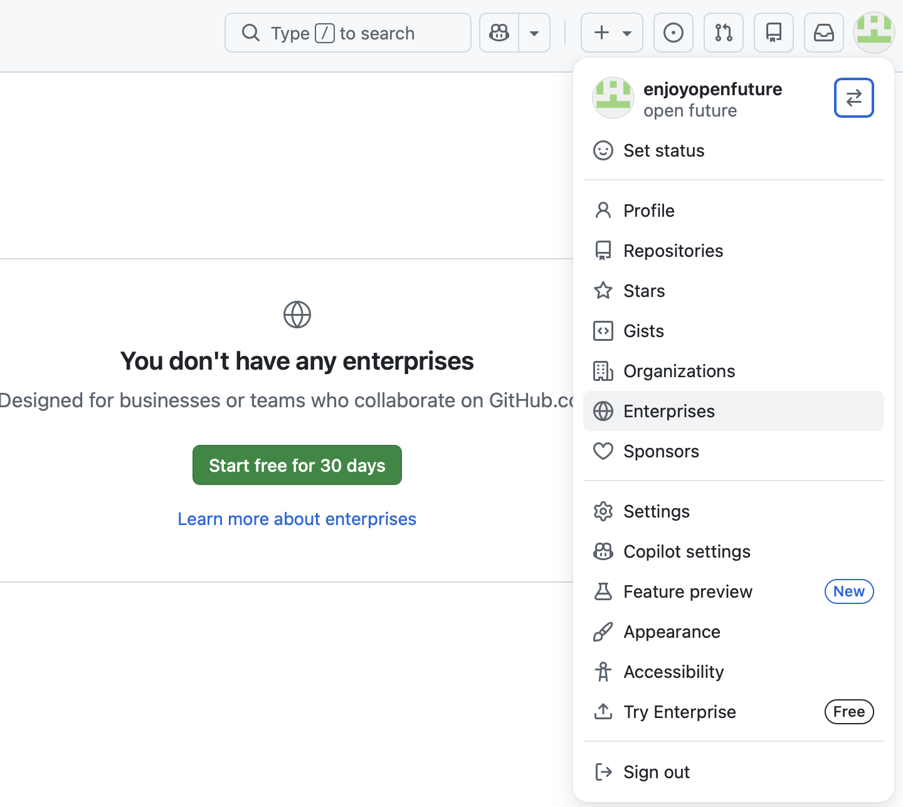

操作要点：

1. 打开右上角个人 profile 菜单。
2. 找到 Enterprise 相关入口。
3. 开始创建新的 Enterprise。

### 4.2 选择 Enterprise Managed Users

Enterprise 类型选择 **Enterprise with managed users**。Identity Provider 选择 **Custom or Other**，表示后续由本项目的 `sso` 服务作为自定义 SAML IdP。

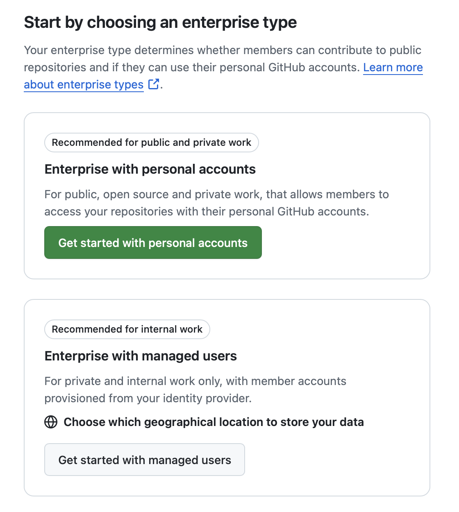

不要选择普通 Enterprise users 模式，否则后续无法按本文方式通过 SCIM 批量管理 EMU 用户。

### 4.3 填写 EMU 信息

填写 Enterprise slug、shortcode 和管理员邮箱。管理员邮箱必须真实可用，因为 GitHub 会把初始超级管理员的密码重置链接发送到该邮箱。

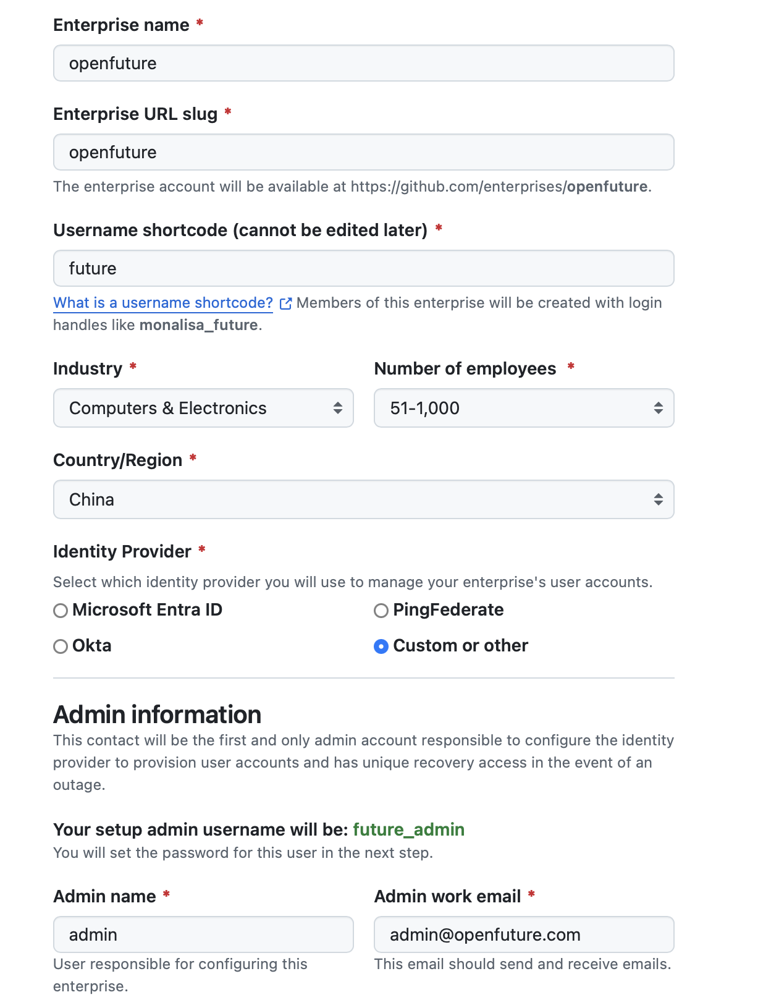

填写时请特别注意：

- slug 创建后会用于 Enterprise URL，也会出现在 `ENTERPRISE_SLUG`、`SCIM_BASE_URL`、`SP_ENTITY_ID`、`SP_ACS_URL` 中。
- shortcode 会影响所有 EMU 用户的 GitHub 登录名。例如本地 SSO 用户 `alice` 可能需要用 `alice_<shortcode>` 登录 GitHub。
- 初始超级管理员通常是 `admin_<shortcode>`。

### 4.4 通过邮件设置初始超级管理员密码

创建成功后，打开管理员邮箱中的 GitHub 邮件，使用其中的密码重置链接设置初始超级管理员密码。

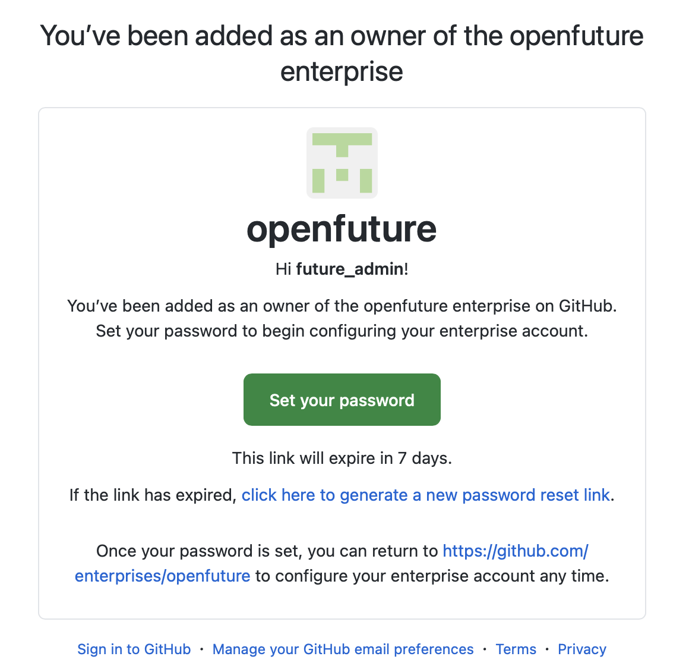

设置密码后，使用 `admin_<shortcode>` 登录 GitHub Enterprise 管理页面。

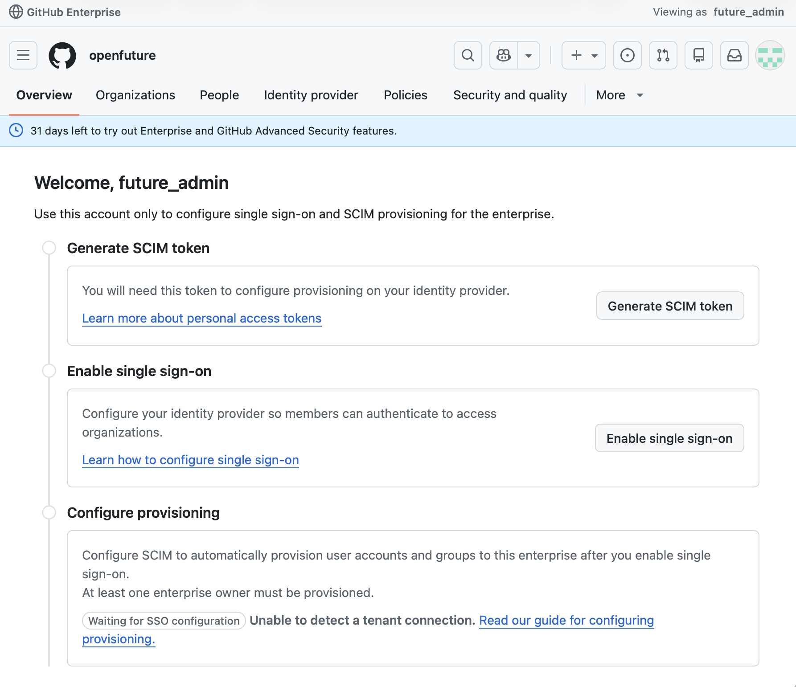

此时个人 GitHub 账号不再直接承担该 EMU Enterprise 的日常管理员身份。后续会通过本项目创建一个新的 SSO 管理员用户，并同步成 GitHub Enterprise 管理员。

## 5. 生成 SCIM token

进入 GitHub Enterprise settings 中的 SAML/SCIM 或 provisioning 相关页面，生成 SCIM token。

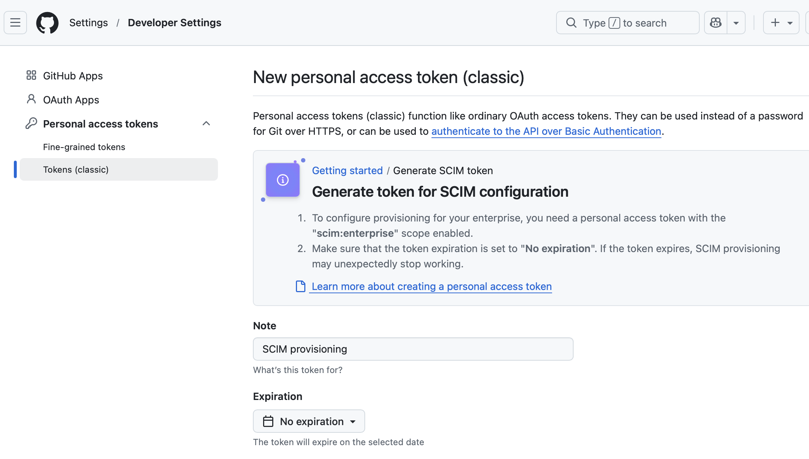

生成后立即复制并保存。SCIM token 后续写入根目录 `.env`：

```env
SCIM_BASE_URL=https://api.github.com/scim/v2/enterprises/<enterprise-slug>
SCIM_TOKEN=<your-scim-token>
```

注意事项：

- token 通常只展示一次。
- 不要把 token 放进截图、聊天记录、issue、commit 或日志。
- 如果 token 泄露，应立即在 GitHub Enterprise 中吊销并重新生成。

## 6. 配置并启动本项目基础服务

### 6.1 准备 `.env`

在仓库根目录执行：

```bash
cp .env.example .env
```

至少需要替换以下值：

| 变量 | 说明 |
| --- | --- |
| `API_KEY` | 调用 `proxy` 公共 API 使用。调用方用 `Authorization: Bearer <API_KEY>` 或 `x-api-key: <API_KEY>`。 |
| `INTERNAL_API_TOKEN` | 内部 API 共享密钥。`proxy`、`sso`、`login`、`console` 必须一致。 |
| `SESSION_SECRET` | `sso` / `console` cookie session 签名密钥。生产环境必须使用强随机值。 |
| `SSO_PUBLIC_BASE_URL` | `sso` 服务对 GitHub 可访问的公网地址。 |
| `SP_ENTITY_ID` | `https://github.com/enterprises/<enterprise-slug>`。 |
| `SP_ACS_URL` | `https://github.com/enterprises/<enterprise-slug>/saml/consume`。 |
| `ENTERPRISE_SLUG` | 创建 EMU 时填写的 slug。 |
| `ENTERPRISE_SHORTCODE` | 创建 EMU 时填写的 shortcode。 |
| `SCIM_BASE_URL` | `https://api.github.com/scim/v2/enterprises/<enterprise-slug>`。 |
| `SCIM_TOKEN` | 第 5 节生成的 SCIM token。 |
| `GITHUB_COPILOT_SEAT_PAT` | 第 9 节创建的 GitHub 管理 PAT；此时还没有可以先留空，创建后再补。 |
| `LOGIN_SSO_URL` | `login` 服务中的浏览器能够访问的 SSO 登录地址。通常可以使用 `https://<sso-public-base-url>:7001` 或者 `http://<sso-public-base-url>:7001/login`。 |

如果使用 Docker Compose，默认端口来自 `.env`：

```env
PROXY_PORT=3000
SSO_PORT=7001
LOGIN_PORT=7003
CONSOLE_PORT=7004
```


### 6.2 生成 SAML 证书

开发验证可执行：

```bash
bash scripts/gen-certs.sh
```

默认会生成：

```text
certs/idp-cert.pem
certs/idp-key.pem
```

其中 `idp-cert.pem` 的内容会复制到 GitHub Enterprise SAML 配置页面的 **Public certificate** 字段；`idp-key.pem` 由 `sso` 服务用于签名 SAMLResponse。

生产环境建议使用你自己维护的正式证书和私钥，并通过 `SSO_CERT_DIR` 指向证书目录。

### 6.3 启动 SSO 与 Console

用 Docker Compose 启动完整服务（因为配置还未完成，所以完整服务会有部分功能不可用）：

```bash
npm run compose:up
```

或者在本地开发模式下单独启动服务（当前阶段只需要sso 和 console）：

```bash
npm install
npm run start:sso
npm --workspace @ghcp/console run build
npm run start:console
```

截图中的步骤展示了启动sso的配置文件：

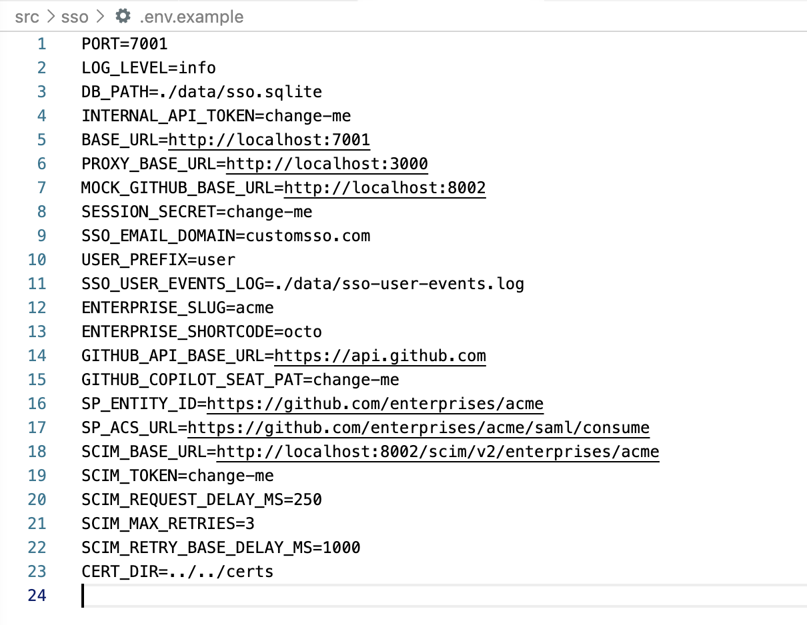

启动后打开：

```text
http://localhost:7004
```

首次访问 console 会创建本地控制台管理员（都是admin）。这个管理员只用于登录本项目 `console`，不是 GitHub Enterprise 管理员。

### 6.4 创建首个 SSO 管理员用户

在 console 的 SSO Users 页面创建第一个 SSO 用户，并将它设置为管理员角色。该用户同步到 GitHub Enterprise 后，会作为新的 GitHub Enterprise 管理员使用。

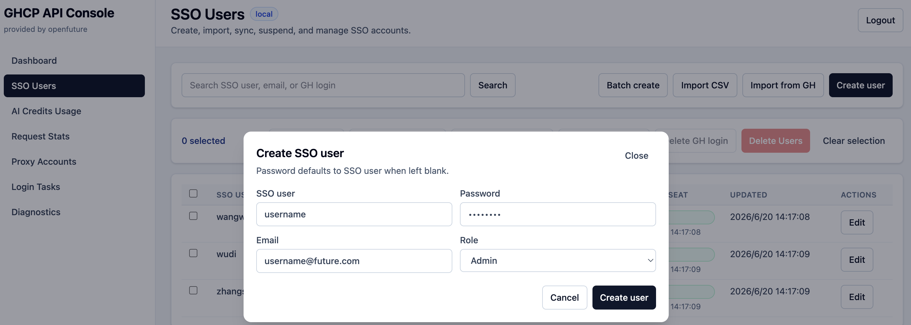

请记录：

- SSO 用户名。
- SSO 登录密码。
- 该用户的管理员角色。
- 对应 GitHub 登录名格式：`<ssoUser>_<enterprise-shortcode>`。

本项目中，SSO 本地用户角色为 `admin` 时，同步 EMU 时可映射为 GitHub Enterprise 的 `enterprise_owner`。

## 7. 配置 GitHub Enterprise SAML SSO

### 7.1 打开 SAML SSO 配置

回到 GitHub Enterprise settings，进入 SAML SSO 配置页面。

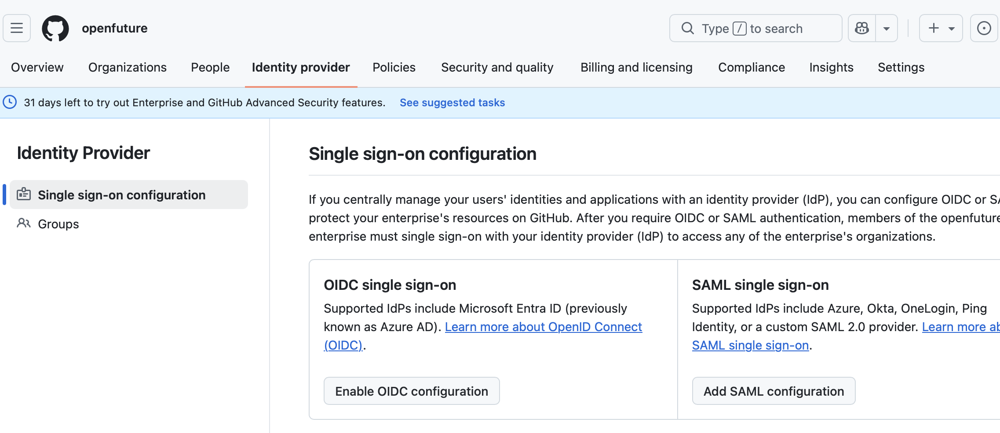

### 7.2 填写 SAML 配置

在 single sign-on configuration 页面填写：

| GitHub 字段 | 填写值 |
| --- | --- |
| Sign on URL | `https://<sso-public-base-url>/sso` |
| Issuer | `https://<sso-public-base-url>/metadata` |
| Public certificate | `certs/idp-cert.pem` 文件内容 |

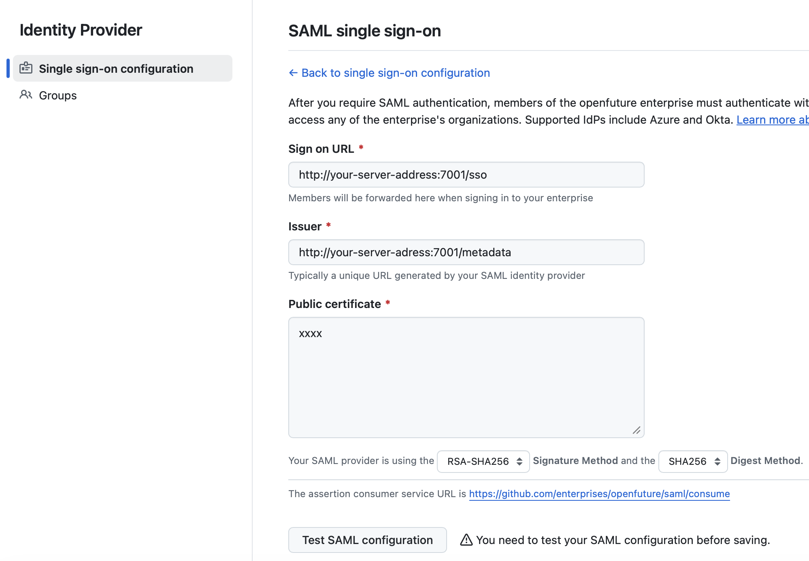

配置关系必须保持一致：

- `.env` 中 `SSO_PUBLIC_BASE_URL` 对应 GitHub 页面中的 SSO URL 和 Issuer。
- `.env` 中 `SP_ENTITY_ID` 对应 GitHub Enterprise SAML SP。
- `.env` 中 `SP_ACS_URL` 对应 GitHub Enterprise SAML ACS。
- `sso` 服务读取的证书目录中必须存在 `idp-cert.pem` 和 `idp-key.pem`。

### 7.3 测试 SAML 登录

GitHub 保存配置前通常会提供测试链接。点击测试链接后，如果能进入本项目 `sso` 登录页，并使用第 6.4 节创建的 SSO 管理员用户成功登录，说明 SAML 主流程可用。

如果测试失败，优先检查：

- `SSO_PUBLIC_BASE_URL` 是否为 GitHub 可访问的公网地址。
- `Sign on URL` 是否以 `/sso` 结尾。
- `Issuer` 是否以 `/metadata` 结尾。
- Public certificate 是否完整复制了 `idp-cert.pem` 内容。
- `SP_ENTITY_ID` 和 `SP_ACS_URL` 是否与当前 Enterprise slug 匹配。

### 7.4 保存 recovery code

SAML 配置保存成功后，GitHub 会生成 recovery code。

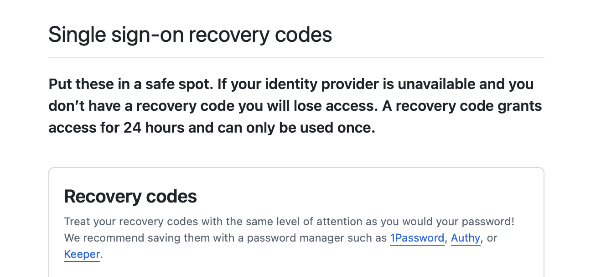

请按企业安全规范离线保存。后续使用初始超级管理员 `admin_<shortcode>` 登录时，可能需要消耗 recovery code。recovery code 不应进入仓库、截图、IM 工具或工单正文。

### 7.5 启用 Open SCIM Configuration

在 SAML 配置页面打开 **Open SCIM Configuration**。

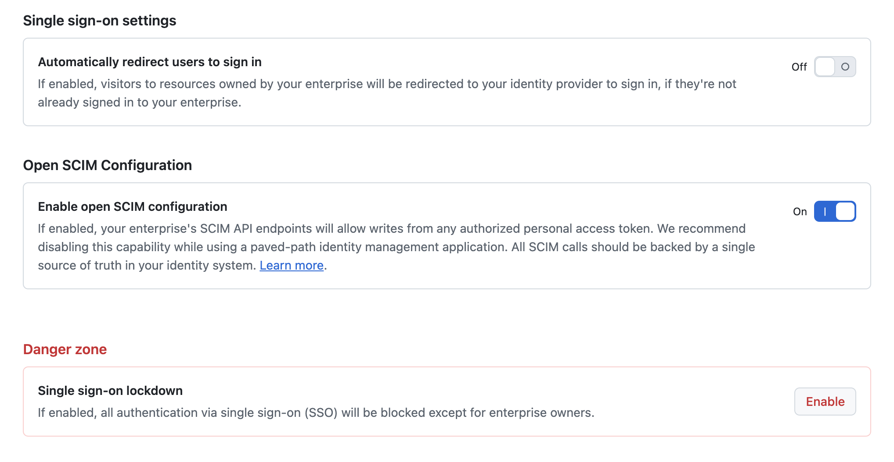

如果没有启用 SCIM，后续从本项目同步用户到 GitHub Enterprise 时可能出现预期错误。这个错误是因为GH的管理员PAT以及copilot功能都没有配置好。

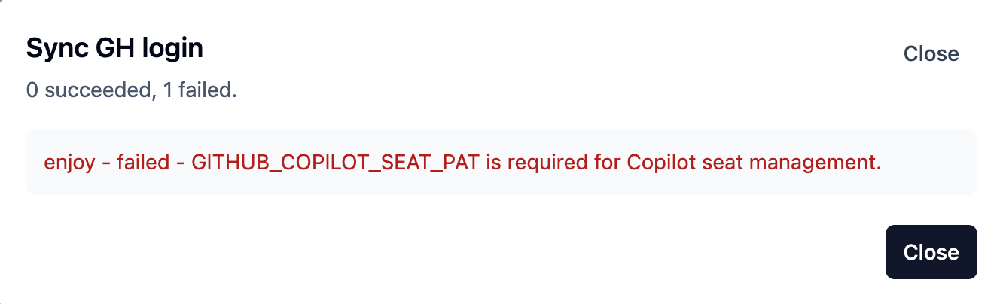


## 8. 同步首个管理员到 GitHub Enterprise

回到 console 的 SSO Users 页面，选择第 6.4 节创建的管理员用户，执行同步 GitHub login / EMU 的操作。

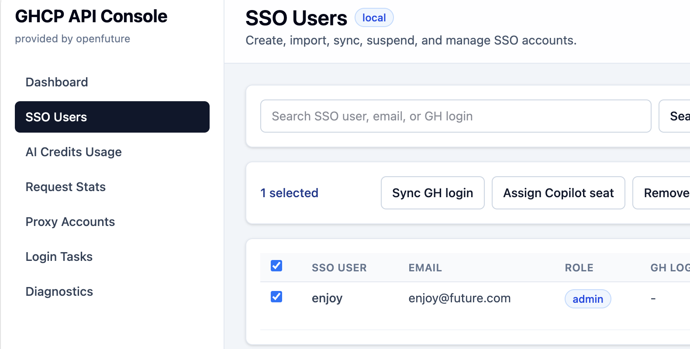

同步成功后，请验证：

- 本地 SSO 用户的 `emuStatus` 为 active 或等价成功状态。
- 记录中有 GitHub login，格式通常为 `<ssoUser>_<shortcode>`。
- 该 GitHub login 可以通过 SAML SSO 登录 GitHub。
- 登录后可以进入 Enterprise 管理页面并看到管理菜单。

后续建议使用这个新同步的管理员账号进行 GitHub Enterprise 日常配置，而不是继续依赖初始 `admin_<shortcode>`。

## 9. 创建 GitHub 管理 PAT

### 9.1 创建 PAT

使用已经同步成功的 GitHub Enterprise 管理员账号登录 GitHub，进入个人 developer settings，创建 PAT。

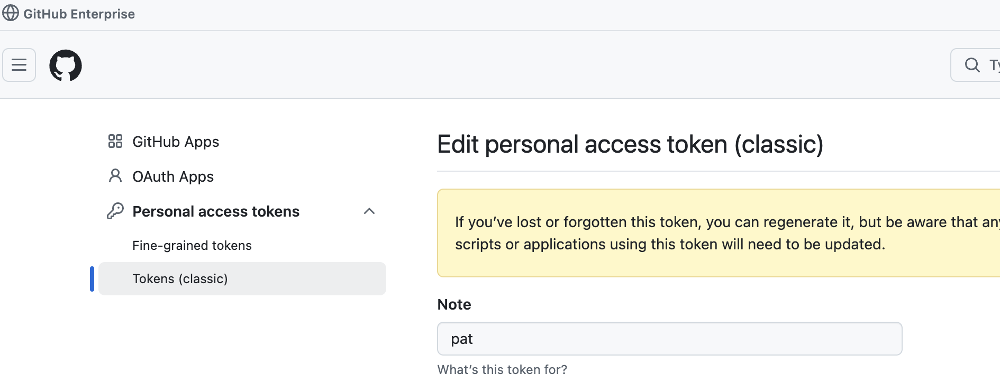

### 9.2 配置 PAT 权限

PAT 需要覆盖本项目调用的 GitHub Enterprise Copilot seat 和 billing usage API。

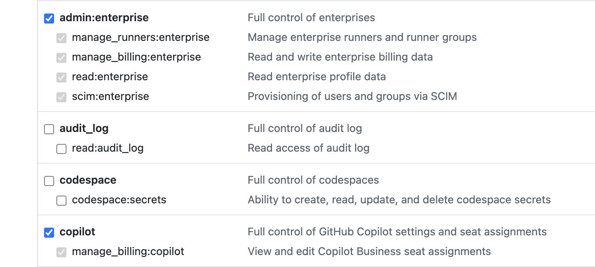

权限选择原则：

- 能管理 Enterprise Copilot seat。
- 能读取 Enterprise billing / usage。
- 如果使用 classic PAT，按 GitHub 当前页面选择 Enterprise 管理、Copilot 管理、billing/usage 读取相关权限。
- 如果使用 fine-grained PAT，以 GitHub 当前支持的企业级权限为准，确保它能访问目标 Enterprise。

创建完成后，把 PAT 写入 `.env`：

```env
GITHUB_COPILOT_SEAT_PAT=<your-github-admin-pat>
```

然后重启 `sso` 服务或重新启动 Docker Compose：

```bash
npm run compose:down
npm run compose:up
```

如果该值为空或权限不足，Copilot seat 分配、移除和 AI Credits 刷新会失败。

## 10. 配置 Billing 与开通 Copilot

### 10.1 填写 payment information

进入 GitHub Enterprise billing 页面，填写 payment information。

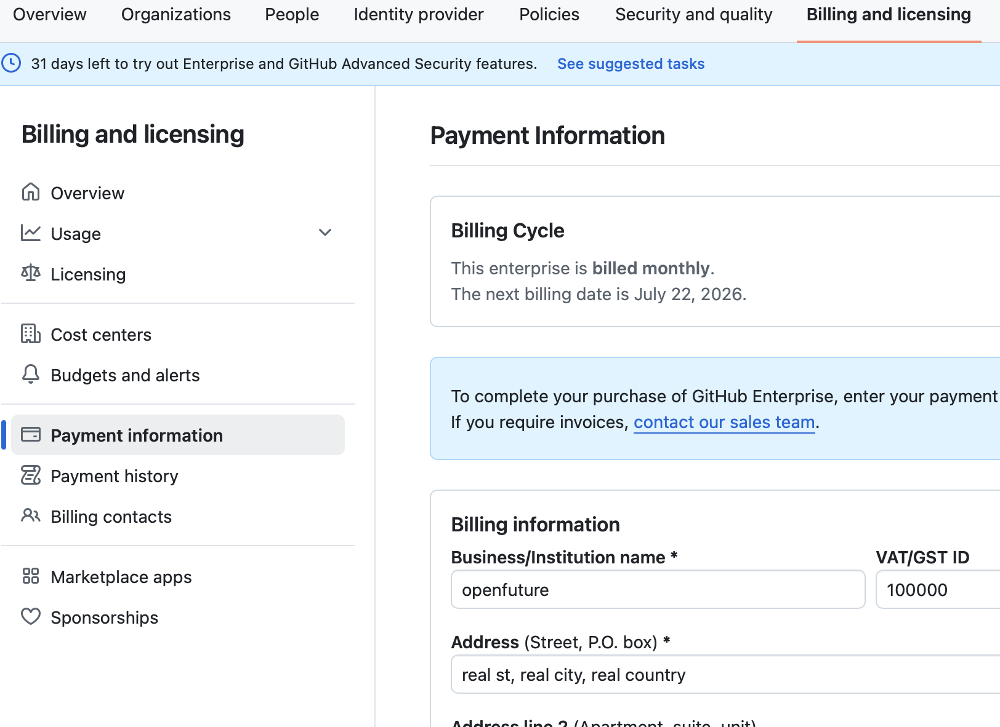

### 10.2 填写或复用 shipping information

如果 shipping information 与 billing information 一致，可以直接复用。

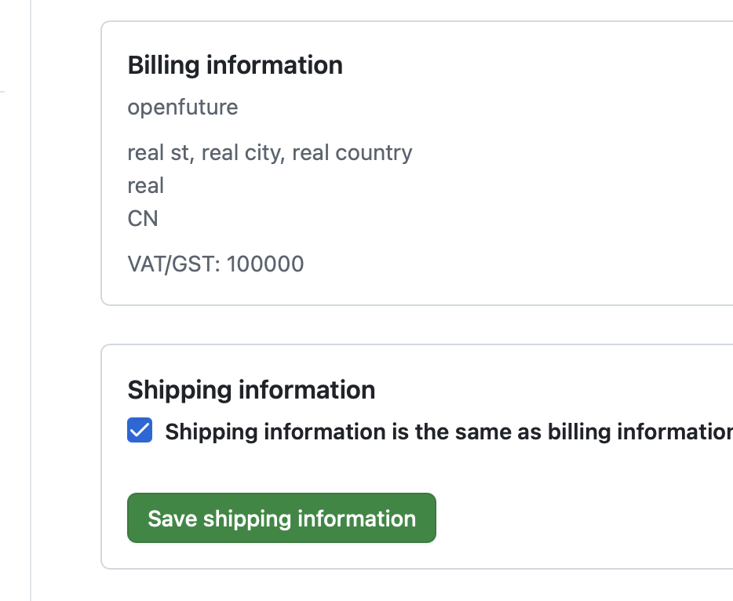

### 10.3 关联 Azure Subscription

在 billing 页面添加 Azure Subscription。

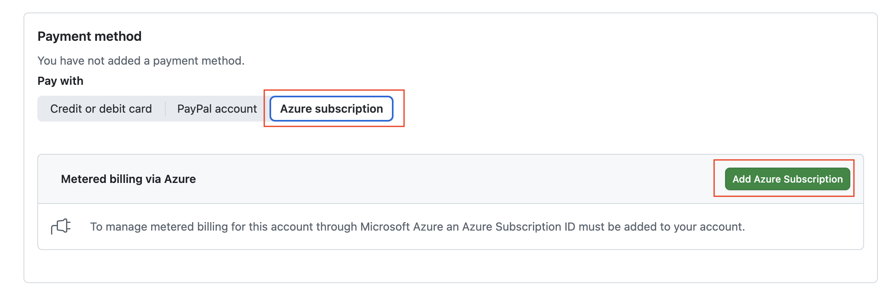

跳转到 Microsoft / Azure 登录页时，使用具备订阅管理权限的 Azure 管理员账号完成授权。

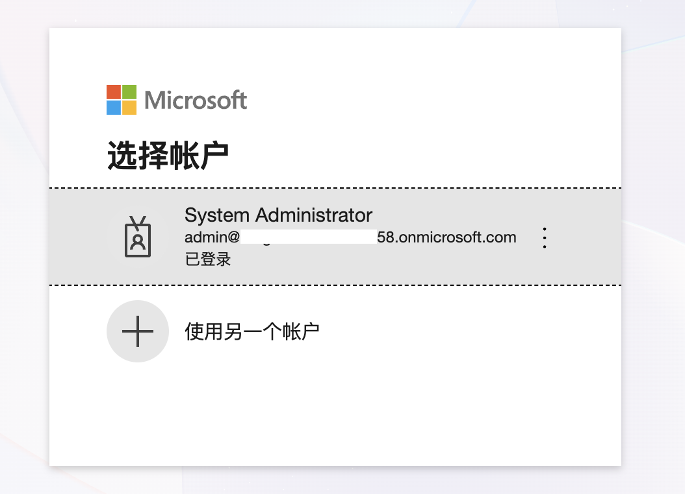

授权完成后回到 GitHub，确认 Azure billing 状态正常。

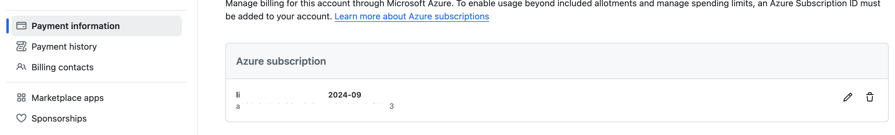

### 10.4 激活 GitHub Enterprise

账单信息配置完成后，激活 GitHub Enterprise。

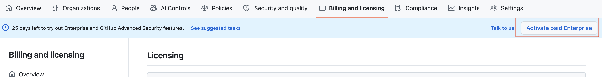

Enterprise 激活完成后，才能继续处理 Copilot 功能开通和 seat 分配。

### 10.5 申请开通 Copilot

如果 Enterprise 中尚未启用 Copilot，需要在 GitHub Support （ https://support.github.com/ ）提交工单，请求开通 GitHub Copilot 功能。

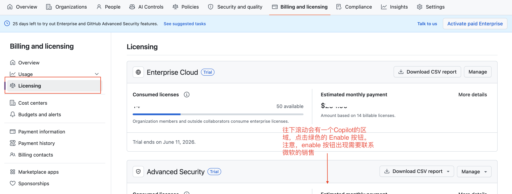

建议记录工单号。如果有 GitHub 销售或客户成功联系人，可以提供工单号以便加速处理。

### 10.6 配置 Copilot 功能参数

Copilot 开通后，进入 Enterprise Copilot 设置页面，按企业策略配置相关功能选项。

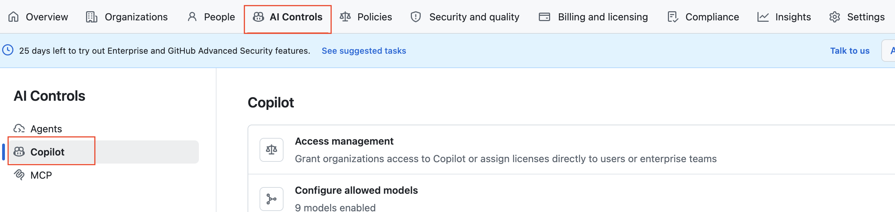

这些选项可能影响：

- 用户能否使用特定 Copilot 功能。
- 模型或功能的可见性。
- 企业级策略与安全边界。
- 最终用户通过本项目 proxy 使用 Copilot 能力时的体验。

### 10.7 分配 Copilot seat

可以在 GitHub Enterprise 页面直接给用户分配 Copilot seat。

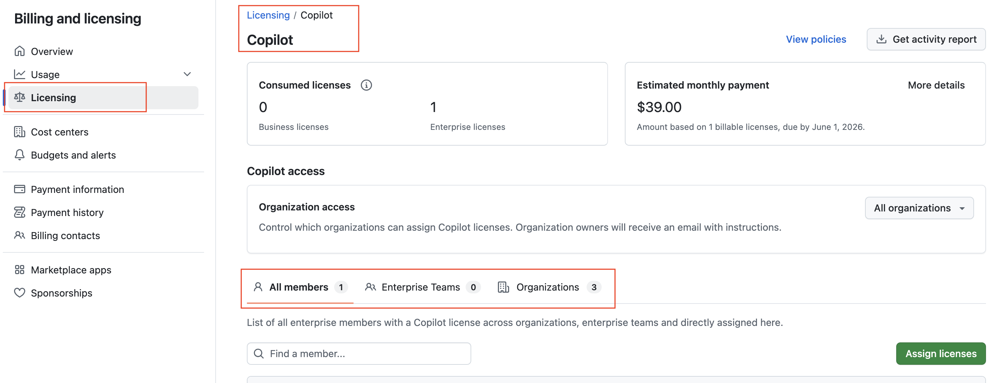

也可以在本项目 console 中对 SSO 用户执行分配或确认 seat 状态。

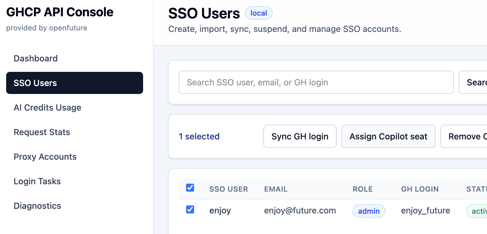

建议至少先给管理员用户分配一个 seat，并确认本项目能正确读取或更新 seat 状态。后续普通用户首次访问 proxy 时，也可以通过 `sso` 的同步逻辑尝试自动分配 seat。

## 11. 完整部署与健康检查

当 Enterprise、SAML、SCIM、PAT、Billing、Copilot 都配置完成后，确认 `.env` 中所有关键值已替换为真实值：

```env
API_KEY=<strong-random-api-key>
INTERNAL_API_TOKEN=<strong-random-internal-token>
SESSION_SECRET=<strong-random-session-secret>
SSO_PUBLIC_BASE_URL=https://<sso-public-base-url>
SSO_CERT_DIR=./certs
SP_ENTITY_ID=https://github.com/enterprises/<enterprise-slug>
SP_ACS_URL=https://github.com/enterprises/<enterprise-slug>/saml/consume
ENTERPRISE_SLUG=<enterprise-slug>
ENTERPRISE_SHORTCODE=<enterprise-shortcode>
SCIM_BASE_URL=https://api.github.com/scim/v2/enterprises/<enterprise-slug>
SCIM_TOKEN=<scim-token>
GITHUB_COPILOT_SEAT_PAT=<github-admin-pat>
LOGIN_SSO_URL=https://<sso-public-base-url>/login
```

启动服务：

```bash
npm run compose:up
```

检查健康状态：

```bash
npm run validate:health
```

也可以分别检查：

```bash
curl http://localhost:3000/healthz
curl http://localhost:7001/healthz
curl http://localhost:7003/healthz
curl http://localhost:7004/healthz
```

完成后打开 console：

```text
http://localhost:7004
```

如果 `console`、`proxy`、`sso`、`login` 任一服务健康检查失败，请先查看对应容器日志，不要先排查用户侧请求。

## 12. GHCP API Console 页面使用说明

### 12.1 Dashboard

Dashboard 用于查看整体运行状态，包括 proxy accounts、SSO users、login tasks、request stats 汇总，以及近期失败任务和失败请求。

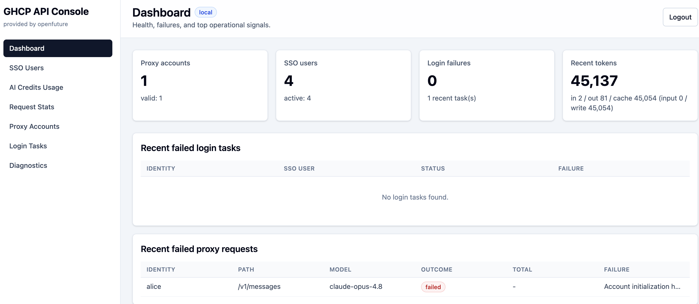

建议日常先看 Dashboard。如果失败任务数量增加，再进入对应页面排查。

### 12.2 SSO Users

SSO Users 页面用于管理本地 SSO 用户和 GitHub EMU 同步。

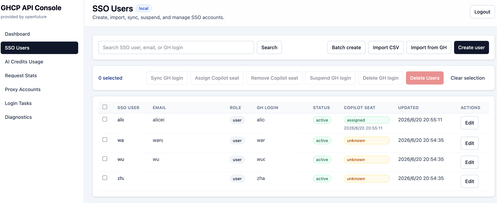

常用操作：

- 查询 SSO 用户。
- 创建单个 SSO 用户。
- 编辑用户密码、邮箱(邮箱是sso同步到gh emu时必须的字段)、角色。
- CSV 批量导入用户。
- 执行 `Sync GH login`，把本地用户同步到 GitHub Enterprise EMU。
- 分配或移除 Copilot seat。
- 删除或暂停 EMU 用户。

如果 GitHub Enterprise 中已有用户，也可以从 GitHub/SCIM 反向导入。这个功能请慎用，主要是为了两个系统之间对账用。

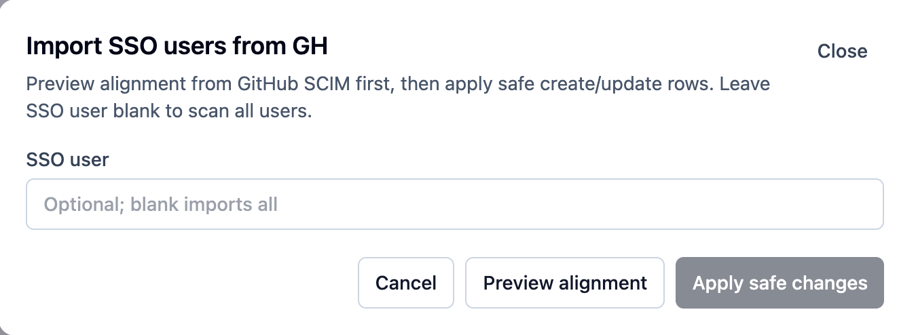

导入建议先 preview，再确认 apply，避免覆盖本地已有用户关系。

### 12.3 AI Credits Usage

AI Credits Usage 页面用于读取和刷新 Enterprise AI Credits 用量。

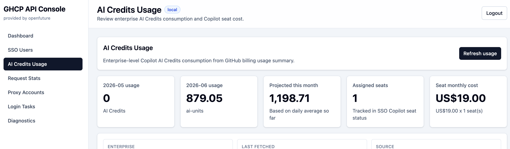

刷新时，`sso` 会调用 GitHub billing usage summary API，读取上月和本月 `copilot_ai_unit` 用量并缓存。页面中还会显示当前已分配 seat 数量和按每 seat 每月 19 美元估算的 seat 成本。

如果刷新失败，优先检查：

- `GITHUB_COPILOT_SEAT_PAT` 是否已配置。
- PAT 是否有 Enterprise billing usage 读取权限。
- `ENTERPRISE_SLUG` 是否正确。
- Enterprise 是否已开通 Copilot 和 billing。

### 12.4 Request Stats / Token 状态

Request Stats 页面用于查看 proxy 接收的请求统计，包括路径、模型、成功状态、失败原因、input token、output token、cache token 等。

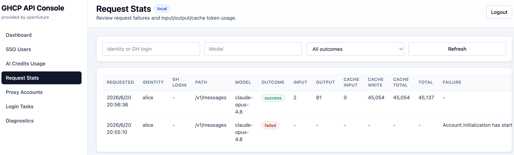

默认每个账号保留最近 `REQUEST_STATS_PER_ACCOUNT_LIMIT=100` 条记录，因为数据存储在本地的sqllite里，如果有大量存储的需求，请修改存储方式。排查模型不可用、路径不匹配、Copilot token 失效时，优先查看这里。

### 12.5 Proxy Accounts

Proxy Accounts 页面展示当前 proxy 中生效的账号状态。

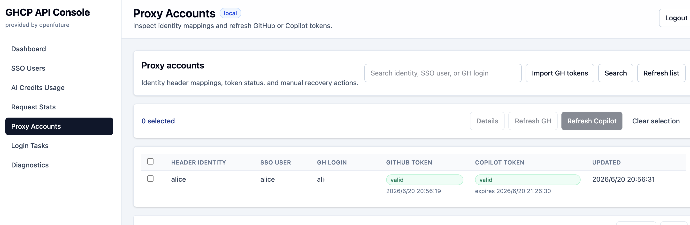

常用操作：

- 查看 identity、SSO 用户、GitHub login 的映射。
- 查看 GitHub token 状态。
- 刷新 GitHub token；这会触发 `login` 自动登录流程。
- 刷新 Copilot token。
- 手动导入 GitHub token。

如果用户请求一直返回初始化中或 token 相关错误，通常需要同时检查 Proxy Accounts 和 Login Tasks。

### 12.6 Login Tasks

Login Tasks 页面展示 `login` 服务的自动登录任务。

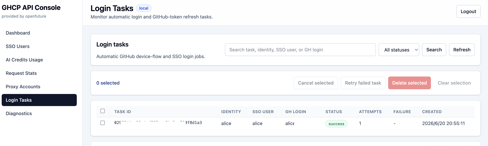

常见状态含义：

| 状态 | 含义 |
| --- | --- |
| `pending` | 任务已创建，等待执行。 |
| `running` | Playwright 正在执行 GitHub device flow 和 SSO 登录。 |
| `completed` | 登录成功，GitHub token 已回写给 proxy。 |
| `failed` | 登录失败，需要查看错误信息、账号密码、SAML 配置或 GitHub 页面变化。 |
| `cancelled` | 任务被取消。 |

`login` 队列是进程内队列，默认 `LOGIN_CONCURRENCY=1`。不建议盲目提高并发，因为 GitHub 登录和 SSO 浏览器自动化对稳定性较敏感，单出口 IP 的并发登录承载也没有公开稳定保证。单次登陆大约1-2分钟。

### 12.7 Diagnostics

Diagnostics 页面用于检查 `proxy`、`sso`、`login-service` 连通性，以及内部 token 是否匹配。当前截图集中没有单独的 Diagnostics 图，但正式排查时建议优先使用它确认服务间基础链路。

重点检查：

- `console` 能否访问 `proxy`、`sso`、`login`。
- `INTERNAL_API_TOKEN` 是否一致。
- 内部 API 是否返回 401。
- 服务地址是否配置成了容器不可访问的 localhost。

## 13. 最终用户如何调用 API

### 13.1 请求头

默认情况下，调用方需要带：

```http
Authorization: Bearer <API_KEY>
X-User-Identity: <your-user-identity>
Content-Type: application/json
```

也可以在部分兼容接口中使用：

```http
x-api-key: <API_KEY>
X-User-Identity: <your-user-identity>
```

`X-User-Identity` 是 proxy 用来区分最终用户身份的关键字段。默认配置如下：

```env
IDENTITY_HEADER=X-User-Identity
IDENTITY_HEADER_REQUIRED=true
```

如果把 `IDENTITY_HEADER` 改成其他名称，客户端请求也必须同步修改。如果 `IDENTITY_HEADER_REQUIRED=false`，缺失身份头时 proxy 会使用 `default` 身份（也就是会在sso中创建名为 default的用户）；即使设置为 false，只要请求中带了身份头，仍会使用该身份头对应的用户。

### 13.2 首次访问行为

某个 identity 第一次访问 proxy 时，如果账号和 token 尚未准备好，proxy 可能返回：

```text
202 account_initializing
```

这是预期行为。后台会依次尝试：

1. 调用 `sso` 确保本地 SSO 用户存在。
2. 通过 SCIM 同步 GitHub EMU。
3. 分配 Copilot seat。
4. 创建 `login` 自动登录任务。
5. 登录成功后把 GitHub token 回写给 proxy。
6. proxy 换取 Copilot token。

完整初始化通常需要 1-2 分钟。完成后再次请求即可正常使用。

### 13.3 验证模型列表

```bash
curl http://localhost:3000/v1/models \
  -H "Authorization: Bearer $API_KEY" \
  -H "X-User-Identity: alice"
```

如果返回模型列表，说明 API key、identity、GitHub token、Copilot token 至少已经基本可用。

### 13.4 Anthropic Messages 示例

```bash
curl http://localhost:3000/v1/messages \
  -H "x-api-key: $API_KEY" \
  -H "X-User-Identity: alice" \
  -H "Content-Type: application/json" \
  -H "anthropic-version: 2023-06-01" \
  -d '{
    "model": "claude-sonnet-4.6",
    "max_tokens": 256,
    "messages": [
      {
        "role": "user",
        "content": "用一句话介绍 GitHub Copilot。"
      }
    ]
  }'
```

`CLAUDE_CODE_OPTIMIZED=true` 时，proxy 会开启 Claude Code / Anthropic Messages 兼容优化，并提供 `/v1/messages/count_tokens`。

### 13.5 OpenAI Responses 示例

```bash
curl http://localhost:3000/responses \
  -H "Authorization: Bearer $API_KEY" \
  -H "X-User-Identity: alice" \
  -H "Content-Type: application/json" \
  -d '{
    "model": "gpt-5",
    "input": "用一句话说明 GitHub Copilot 的用途。"
  }'
```

注意：proxy 不会在 OpenAI、Anthropic、Responses 请求体之间互转。调用方必须把请求发到匹配路径，并使用当前账号和目标路径支持的模型。

### 13.6 Claude Code 接入示例

可以在 `~/.claude/settings.json` 中配置：

```json
{
  "$schema": "https://json.schemastore.org/claude-code-settings.json",
  "env": {
    "ANTHROPIC_BASE_URL": "http://localhost:3000",
    "ANTHROPIC_AUTH_TOKEN": "<API_KEY>",
    "ANTHROPIC_CUSTOM_HEADERS": "X-User-Identity: alice",
    "ANTHROPIC_MODEL": "<claude-model-from-v1-models>",
    "DISABLE_NON_ESSENTIAL_MODEL_CALLS": "1",
    "CLAUDE_CODE_DISABLE_NONESSENTIAL_TRAFFIC": "1"
  }
}
```

不要提交包含 `ANTHROPIC_AUTH_TOKEN` 的 settings 文件。

## 14. 安全与运维注意事项

### 14.1 不能提交或公开的内容

以下内容都应视为敏感信息：

- `.env`
- SQLite 数据库
- 日志
- Playwright trace / debug artifact
- GitHub token
- Copilot token
- SCIM token
- GitHub PAT
- SSO 用户密码
- recovery code
- Azure subscription / tenant 信息
- billing 信息

### 14.2 内部 token 与公共 API key

`API_KEY` 和 `INTERNAL_API_TOKEN` 作用不同：

| 变量 | 用途 |
| --- | --- |
| `API_KEY` | 给最终调用方访问 proxy 公共 LLM API 使用。 |
| `INTERNAL_API_TOKEN` | 给 `console`、`proxy`、`sso`、`login` 内部通信使用，对应请求头 `X-Internal-Token`。 |

不要把 `INTERNAL_API_TOKEN` 暴露给最终用户。

### 14.3 证书与公网地址

`sso` 的公网地址和证书配置必须稳定：

- GitHub Enterprise SAML 配置指向的 URL 必须能从 GitHub 访问。
- `SSO_PUBLIC_BASE_URL` 变化后，GitHub SAML 配置也要同步更新。
- 证书变化后，GitHub 页面中的 Public certificate 也要同步更新。
- `idp-key.pem` 泄露时，应重新生成证书并更新 GitHub 配置。

### 14.4 队列和一致性限制

当前项目有几个需要明确理解的限制：

- login 队列是进程内队列，服务重启时未完成的 pending/running 任务会被标记为 failed。
- `sso` 没有后台自动对账、自动重试队列或定时任务。
- SCIM、Copilot seat、proxy 账号清理等跨系统一致性主要依赖显式 API 操作和人工重试。
- Copilot 内部接口可能变化，模型可见性、参数、流式格式和路径兼容性都可能受到影响。

## 15. 常见问题排查

| 问题 | 可能原因 | 排查方式 |
| --- | --- | --- |
| SAML 测试失败 | SSO 公网地址不可达；Issuer 错误；证书不匹配；ACS 配置不一致 | 检查 `SSO_PUBLIC_BASE_URL`、GitHub Sign on URL、Issuer、Public certificate、`SP_ENTITY_ID`、`SP_ACS_URL`。 |
| SCIM 同步失败 | SCIM token 无效；Open SCIM Configuration 未启用；Enterprise slug 错误 | 检查 `SCIM_BASE_URL`、`SCIM_TOKEN`、GitHub SCIM 配置页面和 SSO Users 错误详情。 |
| Copilot seat 分配失败 | PAT 为空或权限不足；Copilot 未开通；用户未同步到 EMU | 检查 `GITHUB_COPILOT_SEAT_PAT`、GitHub Copilot 开通状态、用户 `ghLogin` 和 seat 错误详情。 |
| AI Credits 刷新失败 | PAT 没有 billing usage 权限；Enterprise billing 未激活 | 检查 PAT 权限、Billing 状态、AI Credits Usage 页面错误。 |
| 首次请求一直 `account_initializing` | login 任务失败；SSO 密码错误；GitHub SAML 登录失败；seat 未分配 | 查看 Dashboard、Proxy Accounts、Login Tasks、SSO Users 的状态和错误信息。 |
| 请求返回 401 | `API_KEY` 错误；使用了错误的认证头；内部 token 不一致 | 公共 API 检查 `Authorization` / `x-api-key`；console/内部 API 检查 `INTERNAL_API_TOKEN`。 |
| 请求返回 missing identity | 未带 `X-User-Identity`；自定义了 `IDENTITY_HEADER` 但客户端未同步 | 检查 proxy `.env` 和客户端请求头。 |
| 模型不可用 | 模型不支持目标 API path；账号不可见该模型；`CLAUDE_CODE_OPTIMIZED` 影响 `/v1/models` 返回 | 先调用 `/v1/models`，再按返回模型选择 `/v1/messages`、`/responses` 或 `/chat/completions`。 |
| Copilot token 刷新失败 | GitHub token 失效；用户没有 Copilot seat；GitHub 后端接口变化 | 在 Proxy Accounts 刷新 GitHub token，再确认 seat 状态，然后刷新 Copilot token。 |

## 16. 完成配置后的验收清单

建议按以下顺序确认配置已经跑通：

1. GitHub Enterprise EMU 创建完成，可以使用 `admin_<shortcode>` 登录。
2. GitHub Enterprise 已生成 SCIM token，并写入 `.env`。
3. `sso` 的 `/metadata` 和 `/sso` 可被 GitHub 访问。
4. SAML SSO 测试成功，recovery code 已安全保存。
5. Open SCIM Configuration 已启用。
6. console 中首个 SSO 管理员已同步到 GitHub，且可用 `<ssoUser>_<shortcode>` 登录。
7. 管理 PAT 已写入 `GITHUB_COPILOT_SEAT_PAT`，`sso` 已重启。
8. Billing 已配置，GitHub Enterprise 已激活。
9. Copilot 已开通，管理员或测试用户已有 Copilot seat。
10. `npm run validate:health` 通过。
11. Dashboard 无异常失败任务。
12. Proxy Accounts 中测试 identity 的 GitHub token 和 Copilot token 状态正常。
13. Login Tasks 中测试登录任务为 completed。
14. `/v1/models` 能返回模型列表。
15. `/v1/messages` 或 `/responses` 能成功返回模型响应。

完成以上检查后，本项目的 GitHub Enterprise EMU、SSO、SCIM、Copilot seat、自动登录和 API proxy 主链路即已跑通。
